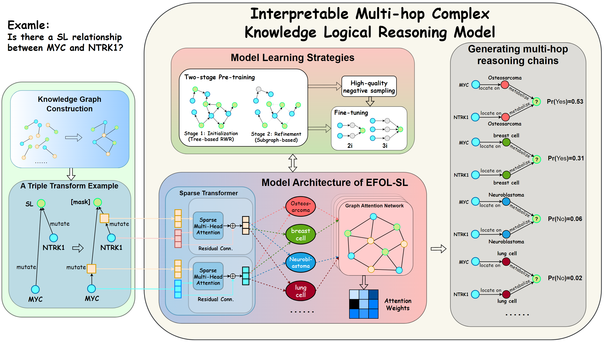

# EFOL-SL



**This is the data and code for our paper** `Interpretable Complex Knowledge Multi-hop Reasoning Model for Predicting Synthetic Lethality in Human Cancers`.

## Prerequisites

* `cuda version < 11.0`
* `pytorch>=1.7.1 & <=1.9`
  * Note: Pytorch version greater than 1.9 has OOM bugs. See <https://github.com/pytorch/pytorch/issues/67680>.
* `torch-geometric`

Example installation using [`conda`](https://conda.io):

```bash
# Use the cuda version that matches your nvidia driver and pytorch
conda install pytorch=1.8.1 cudatoolkit=10.1 pyg -c pyg -c pytorch -y
```

## Datastes

We provide the dataset in the [data](data/) folder.

| Data | Description |
| --- | --- |
| [SynLethDB-v1.0](data/SynLethDB-v1.0/)| 19,667 SL interactions among 6375 genes. |
| [SynLethDB-v2.0](data/SynLethDB-v2.0/) | 36,741 SL interactions among 10,218 genes. |

## Reproduction

The parameters in the paper is preloaded in [`./src/configs/`](src/configs/).
Change `root_dir` option for the location to save model checkpoints.

The location for the extracted dataset
should be specified in the `data_dir` in the config files.
For exmpale, if the `SynLethDB-v2.0` dataset is in `/data/SynLethDB-v2.0`,
this is what the `data_dir` options should be set.

Alternatively, pretrained models are available
at [Google Drive](https://drive.google.com/drive/folders/1fBAwWtJiq7RPufBPvhPEhFsyHIB3oIm9).

To reproduce all results for `SynLethDB-v2.0`:

```bash
efol_sl="python main.py -c configs/configs.json"
$ efol_sl training_2i 
$ efol_sl testing_2i
```

## Documentation

```
src
  │  data_util.py
  │  deter_util.py
  │  graph_util.py
  │  main.py
  │  metric.py
  │  model.py
  │  sampler.py
  │  train.py
  ├─configs
        │  configs.json
  ├─pretrained_model
  └─tasks
        │  base.py
        │  betae.py
        │  pretrain.py
        │  real_query.py
        │  reasoning.py
        │  __init__.py
```

### Model

The basic structure of our model an be found in `model.py`.
The model can be divided into 4 parts, triplet transform, enhancement module, Cross-Transformer and GCN decoder. They can be used in function `TokenEmbedding`, `Cross_Transformer` and `GCN`.

### Training

Training-related utilities can be found in [`train.py`](./src/train.py).
They accept `Iterator`'s that yield batched data,
identical to the output of a `torch.utils.data.DataLoader`.
The most useful functions are `main_mp()` and `ft_test()`.

`TrainClient` scatters data onto different workers
and perform multi-GPU training based on `torch.nn.parallel.DistributedDataParallel`.

### Config Files

Each config file is a JSON key-value mapping that maps a task name to a task.
The tasks can be run directly from the command line:

```bash
python main.py <task_name> [<task_name>...]
```

In a specific task, `base` option specifies the task it should inherit from.
`type` option specifies the type of operation of this configuration.
See [`./src/main.py`](./src/main.py) for a full list of available options.

## Troubleshooting

<details>

<summary>CUDA Out of Memory</summary>

We run experiments with V100(32GB) GPUs, please reduce the batch size if you don't have enough resources. Be aware that smaller batch size will hurt the performance for contrastive training
If the issue persists after adjusting batch size, downgrade pytorch to as early as possible (e.g. LTS 1.8.1 as of 2021/03).
This is possibly due to memory issues in higher pytorch versions.
See <https://github.com/pytorch/pytorch/issues/67680> for more information.

</details>

<details>

<summary>torch-geometric installation is failed</summary>

Please try downgrading the cuda version. Due to library dependency, torch_cluster, torch_scatter, torch_sparse and torch_spline_conv are required to install torch-geometric installations.

</details>

## Authors

**Junkai Cheng** @github.com/Cheng0829 \
**Email:** chengjunkai829@gmail.com & Cheng0829@dlmu.edu.cn \
**Site:** [GitHub](https://github.com/Cheng0829)

**Yijia Zhang** @github.com/ItrecTextming \
**Email:** zhangyijia@dlmu.edu.cn \
**Site:** [GitHub](https://github.com/ItrecTextming)

## Acknowledgement

We refer to the code of [kgTransformer](https://github.com/THUDM/kgTransformer). Thanks for their contributions.
